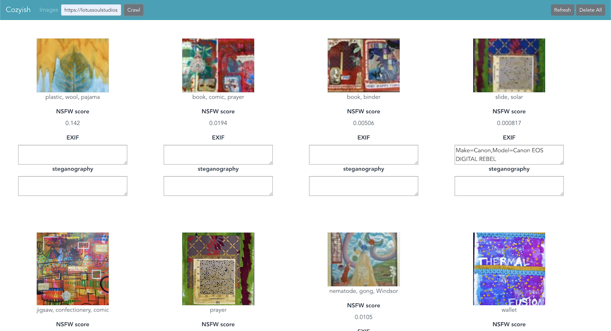

# cozyish




### Concept
* The crawler searches a site url for png & jpg images and indexes them. 
* The video app converts video streams to indexed jpg images. 

The images are then stored, analyzed, and classified.

* [NSFW classifier by yahoo](https://github.com/yahoo/open_nsfw): classifier with nudity score 0 to 1
* [Classification tags by Deepdetect](https://www.deepdetect.com):   Currently using [the ilsrvc_googlenet pretrained model](https://www.deepdetect.com/models/ilsvrc_googlenet/).  
* [EXIF reader](https://github.com/dsoprea/go-exif)
* [LSB-Steganography reader](https://github.com/auyer/steganography) 


```json
{
    "exif": [
        ...
        {
            "GPSLatitudeRef": "N"
        },
        {
            "GPSLatitude": "26/1"
        },
        {
            "GPSLongitudeRef": "W"
        },
        {
            "GPSLongitude": "80/1"
        },
        ...
    ],
    "id": "ähJäYZöh",
    "image": "path.jpg",
    "nsfw_score": 0.016476402059197426,
    "steganography": "This message was hidden in the image.",
    "tags": [
        "child",
        "ball"
    ]
}
```

### Running Locally
```bash
docker-compose build

docker-compose up
```
* Open http://localhost:7777 in a web browser

### Running in Kubernetes
```bash
cd k8s
# example, EKS cluster
make create

# kompose create the cluster config
make kubectl

# deploy to cluster
make deploy
```

### API
* `:8000/api/index  `     - indexes given the above payload, returns the payload + a generated id field.
* `:8000/api/image  `     - json array of images
* `:8000/api/image/{id}`  - raw image
* `:4444/?url={site} `    - site e.g. http://secretagentsnowman.com

### Dependencies
* [Elasticsearch](https://www.elastic.co/)
* [Minio](https://min.io/)
* [Docker](https://www.docker.com/) & [(docker-compose)](https://docs.docker.com/compose/)
* [RabbitMQ](https://www.rabbitmq.com/)
* [Yahoo open nsfw model](https://github.com/yahoo/open_nsfw)
* [Deep Detect](https://www.deepdetect.com/)
* [go-exif](https://github.com/dsoprea/go-exif)
* [steganography](https://github.com/auyer/steganography)


