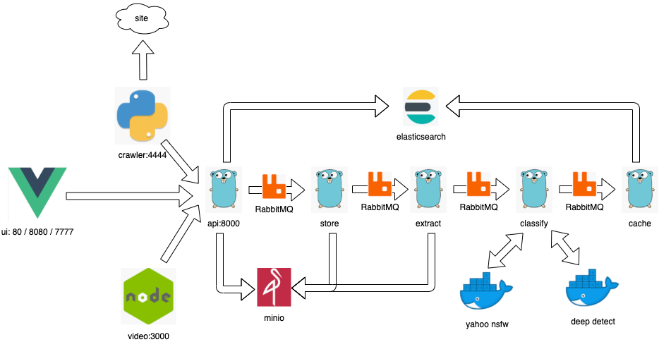

# cozyish

_todo_
* determine how id's are autogenerated
* extract all docker-compose urls to environment variables
* fun learning




### Running
```bash
docker-compose build

docker-compose up
```
